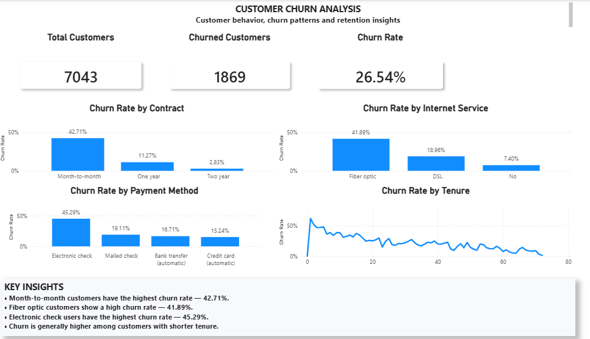

# Customer Churn Analysis

> End-to-end customer churn analysis using Excel, SQL, Python, and Power BI.

---

## 📌 Project Overview

Customer churn is a major business challenge for subscription-based companies. Understanding why customers leave and identifying high-risk customer segments can help businesses improve customer retention and reduce revenue loss.

This project analyzes customer churn data using **Excel, SQL, Python, and Power BI** to identify churn patterns, high-risk customer segments, and actionable retention insights.

---

## 🎯 Business Objective

The main objectives of this project are to:

- Measure the overall customer churn rate.
- Identify customer segments with higher churn risk.
- Analyze churn by contract type.
- Analyze churn by internet service.
- Analyze churn by payment method.
- Understand the relationship between customer tenure and churn.
- Build a professional Power BI dashboard for business reporting.
- Generate actionable recommendations to improve customer retention.

---

## 📊 Dataset

The dataset contains **7,043 customer records** and **33 columns** covering customer demographics, services, billing information, contract details, churn information, and customer lifetime value.

### Key Fields

- `CustomerID`
- `Gender`
- `Senior Citizen`
- `Partner`
- `Dependents`
- `Tenure Months`
- `Phone Service`
- `Multiple Lines`
- `Internet Service`
- `Online Security`
- `Online Backup`
- `Device Protection`
- `Tech Support`
- `Contract`
- `Paperless Billing`
- `Payment Method`
- `Monthly Charges`
- `Total Charges`
- `Churn Label`
- `Churn Value`
- `Churn Score`
- `CLTV`
- `Churn Reason`

---

## 🛠️ Tools & Technologies

| Tool / Technology | Purpose |
|---|---|
| **Microsoft Excel** | Data exploration, cleaning, pivot tables, and initial analysis |
| **MySQL** | Data storage, validation, aggregation, and SQL analysis |
| **Python** | Exploratory Data Analysis (EDA) and visualization |
| **Pandas** | Data manipulation and analysis |
| **Matplotlib** | Data visualization |
| **Power BI** | Interactive dashboard and business reporting |
| **GitHub** | Project documentation and version control |

---

## 🔄 Project Workflow

The project follows an end-to-end data analytics workflow:

```text
Raw Customer Data
       ↓
Data Cleaning & Validation
       ↓
Excel Analysis
       ↓
MySQL Analysis
       ↓
Python EDA
       ↓
Power BI Dashboard
       ↓
Key Insights
       ↓
Business Recommendations
```
---

## 🧹 Data Cleaning & Validation

Before performing the analysis, the dataset was reviewed and validated to ensure data quality and consistency.

### Data Quality Checks

- Checked the dataset dimensions.
- Verified duplicate `CustomerID` values.
- Checked missing values across columns.
- Reviewed numeric and categorical data types.
- Checked `Total Charges` for missing values.
- Validated `Churn Label` and `Churn Value`.
- Created `Monthly_Charge_Band` for monthly charge segmentation.
- Reviewed customer tenure and billing-related fields.

### Validation Results

| Metric | Result |
|---|---:|
| Total Customers | **7,043** |
| Total Columns | **33** |
| Churned Customers | **1,869** |
| Overall Churn Rate | **26.54%** |
| Duplicate CustomerID | **0** |
| Missing Churn Reason | **5,174** |

> **Note:** `Churn Reason` is populated for churned customers. Therefore, the missing values in this column correspond to customers who did not churn, where a churn reason is not applicable.

---

## 📈 Excel Analysis

Microsoft Excel was used for initial data exploration, validation, and pivot-table analysis.

### Analysis Performed

- Overall customer and churn counts
- Churn by contract type
- Churn by tenure
- Churn by internet service
- Churn by payment method
- Churn by monthly charge band
- Customer segmentation using pivot tables

### Key Excel Findings

| Analysis Area | Key Finding |
|---|---|
| Contract | Month-to-month customers have the highest churn |
| Internet Service | Fiber optic customers show a high churn rate |
| Payment Method | Electronic check users have the highest churn |
| Tenure | Shorter-tenure customers are more likely to churn |
| Monthly Charges | Higher monthly charge segments show increased churn in several ranges |

The Excel workbook used for the analysis is available here:

[**Download Excel Analysis**](excel/churn_analysis.xlsx)

---

## 🗄️ SQL Analysis

MySQL was used to store, validate, and analyze the cleaned customer dataset.

### SQL Analysis Performed

- Total customer count
- Churned customer count
- Overall churn rate
- Duplicate `CustomerID` validation
- Missing-value validation
- Churn by contract
- Churn by internet service
- Churn by payment method
- Churn by tenure
- Churn by monthly charge band
- Churn by online security
- Churn by senior citizen
- High-risk customer segment combinations

### Key SQL Findings

| Analysis | Result |
|---|---|
| Total Customers | **7,043** |
| Churned Customers | **1,869** |
| Overall Churn Rate | **26.54%** |
| Highest Contract Churn | **Month-to-month** |
| Highest Internet Service Churn | **Fiber optic** |
| Highest Payment Method Churn | **Electronic check** |

The complete SQL script is available here:

[**View SQL Analysis**](sql/churn_analysis.sql)

---

## 🐍 Python EDA

Python was used to perform Exploratory Data Analysis (EDA), validate the dataset, calculate key churn metrics, and identify important customer churn patterns.

### Libraries Used

- **Pandas** — Data loading, cleaning, manipulation, and analysis
- **Matplotlib** — Data visualization

### EDA Process

The Python analysis followed these steps:

1. Loaded the cleaned customer dataset using Pandas.
2. Reviewed the dataset columns and structure.
3. Checked missing values across all columns.
4. Calculated the total number of customers.
5. Calculated the number of churned customers.
6. Calculated the overall churn rate.
7. Analyzed churn by contract type.
8. Analyzed churn by internet service.
9. Analyzed churn by payment method.
10. Analyzed churn by customer tenure.
11. Created visualizations to compare churn rates across different customer segments.

### Key Python Results

| Metric | Result |
|---|---:|
| Total Customers | **7,043** |
| Churned Customers | **1,869** |
| Overall Churn Rate | **26.54%** |

### Churn Analysis

#### Churn by Contract

The analysis shows that **month-to-month customers have the highest churn rate**, while customers with longer-term contracts have significantly lower churn.

#### Churn by Internet Service

**Fiber optic customers show a significantly higher churn rate** compared with DSL and customers without internet service.

#### Churn by Payment Method

Customers using **electronic check** have the highest churn rate among the analyzed payment methods.

#### Churn by Tenure

Customers with **shorter tenure** generally show higher churn rates, indicating that the early customer lifecycle is an important period for retention efforts.

### Python Visualization

Python visualizations were created to better understand:

- Churn Rate by Contract
- Churn Rate by Internet Service
- Churn Rate by Payment Method
- Churn Rate by Tenure

### Python Script

The complete Python analysis script is available here:

[**View Python Analysis**](python/churn_analysis.py)

---

## 📊 Power BI Dashboard

Power BI was used to build an interactive customer churn dashboard that combines key performance indicators, churn analysis, and customer segmentation into a single business-focused report.

### Dashboard Objectives

The dashboard was designed to help stakeholders:

- Monitor the overall customer churn rate.
- Understand the number of churned customers.
- Compare churn across contract types.
- Compare churn across internet service types.
- Analyze churn by payment method.
- Understand how customer tenure relates to churn.
- Identify high-risk customer segments.

### Key Performance Indicators

| KPI | Value |
|---|---:|
| **Total Customers** | **7,043** |
| **Churned Customers** | **1,869** |
| **Churn Rate** | **26.54%** |

### Dashboard Visuals

The dashboard includes:

- **Total Customers KPI**
- **Churned Customers KPI**
- **Churn Rate KPI**
- **Churn by Contract**
- **Churn by Internet Service**
- **Churn by Payment Method**
- **Churn by Tenure**
- Customer churn segmentation and supporting analysis

### Dashboard Preview



### Power BI File

The complete interactive Power BI dashboard is available here:

[**Open Power BI Dashboard File**](powerbi/Customer_Churn_Analysis.pbix)

---

## 🔍 Key Insights

The analysis identified several important customer churn patterns.

### 1. Contract Type

**Month-to-month customers have the highest churn rate at 42.71%.**

Churn rates by contract:

| Contract Type | Churn Rate |
|---|---:|
| Month-to-month | **42.71%** |
| One year | **11.27%** |
| Two year | **2.83%** |

This indicates a strong relationship between contract length and customer retention. Customers with longer-term contracts are significantly less likely to churn.

---

### 2. Internet Service

**Fiber optic customers have the highest churn rate at 41.89%.**

Churn rates by internet service:

| Internet Service | Churn Rate |
|---|---:|
| Fiber optic | **41.89%** |
| DSL | **18.96%** |
| No internet service | **7.40%** |

The high churn rate among fiber optic customers suggests that pricing, service quality, technical support, or customer experience should be investigated further.

---

### 3. Payment Method

**Electronic check users have the highest churn rate at 45.29%.**

Churn rates by payment method:

| Payment Method | Churn Rate |
|---|---:|
| Electronic check | **45.29%** |
| Mailed check | **19.11%** |
| Bank transfer (automatic) | **16.71%** |
| Credit card (automatic) | **15.24%** |

Electronic check users represent a particularly high-risk customer segment.

---

### 4. Customer Tenure

The analysis shows that **customers with shorter tenure are generally more likely to churn**.

This suggests that the early stages of the customer lifecycle are critical for retention.

Businesses should focus on:

- Strong customer onboarding
- Early engagement
- Proactive customer support
- Satisfaction monitoring
- Personalized retention offers

---

### 5. Overall Churn

The dataset contains **7,043 customers**, of which **1,869 customers have churned**.

The overall customer churn rate is **26.54%**.

This means approximately **1 in every 4 customers** in the dataset has churned, highlighting the importance of an effective customer retention strategy.

---

## 💡 Business Recommendations

Based on the analysis, the following data-driven strategies can help reduce customer churn and improve retention.

### 1. Convert Month-to-Month Customers

Month-to-month customers have the highest churn rate.

Recommended actions:

- Offer incentives for upgrading to one-year or two-year contracts.
- Provide loyalty discounts for longer commitments.
- Introduce contract upgrade campaigns for high-risk customers.
- Offer additional benefits with long-term plans.

---

### 2. Investigate Fiber Optic Customer Churn

Fiber optic customers show a significantly higher churn rate.

The business should investigate:

- Service quality
- Pricing and perceived value
- Technical issues
- Customer support experience
- Competitor offers
- Installation and onboarding experience

---

### 3. Reduce Electronic Check Customer Churn

Electronic check users have the highest churn rate among payment methods.

Recommended actions:

- Encourage automatic payment methods.
- Make payment setup easier.
- Provide incentives for automatic payments.
- Send proactive payment reminders.
- Monitor customers who repeatedly experience payment-related issues.

---

### 4. Strengthen Early Customer Engagement

Shorter-tenure customers are more likely to churn.

The business should focus on the first few months of the customer lifecycle through:

- Improved onboarding
- Welcome campaigns
- Early satisfaction surveys
- Proactive customer support
- Personalized offers
- Early churn-risk monitoring

---

### 5. Build a Churn-Risk Monitoring Strategy

Customer churn analysis should become an ongoing business process rather than a one-time analysis.

A regular churn monitoring system can help the business:

- Identify high-risk customers early.
- Track churn trends over time.
- Measure retention campaign effectiveness.
- Prioritize customer service efforts.
- Improve customer lifetime value.

---

## 🎯 Expected Business Impact

Implementing these strategies can help the business:

- Reduce customer churn.
- Improve customer retention.
- Increase customer lifetime value.
- Improve customer experience.
- Identify high-risk customers earlier.
- Support data-driven retention decisions.

---

## 📁 Project Structure

The repository is organized by analysis stage to keep the project clean, professional, and easy to navigate.

```text
customer-churn-analysis/
│
├── data/
│   └── churn_cleaned.csv
│
├── excel/
│   └── churn_analysis.xlsx
│
├── sql/
│   └── churn_analysis.sql
│
├── python/
│   └── churn_analysis.py
│
├── powerbi/
│   └── Customer_Churn_Analysis.pbix
│
├── dashboard/
│   └── customer_churn_dashboard.png
│
└── README.md
```
---

## 🏁 Project Outcome

This project demonstrates a complete end-to-end data analytics workflow, from raw customer data to business-focused insights.

### What This Project Demonstrates

- Data cleaning and validation
- Exploratory data analysis
- Excel-based business analysis
- SQL data analysis using MySQL
- Python-based EDA and visualization
- Interactive Power BI dashboard development
- Customer segmentation
- Churn pattern identification
- Business insight generation
- Data-driven retention recommendations

### Final Outcome

The analysis identified several high-risk customer segments, including:

- Month-to-month contract customers
- Fiber optic internet customers
- Electronic check payment users
- Shorter-tenure customers

These findings can help businesses prioritize retention efforts and develop targeted strategies to reduce customer churn.

### End-to-End Analytics Flow

```text
Data
  ↓
Cleaning
  ↓
Exploration
  ↓
SQL Analysis
  ↓
Python EDA
  ↓
Power BI
  ↓
Insights
  ↓
Business Recommendations
```

The project demonstrates how data can be transformed into actionable business intelligence through a combination of analytical tools and techniques.

---

## 👤 Author

**Md. Javed Ali**

Data Analyst  
**Excel | SQL | Python | Power BI**

### 🔗 Connect With Me

- 🌐 **Portfolio:** https://javedali-analytics.github.io/portfolio/
- 💼 **LinkedIn:** https://www.linkedin.com/in/md-javed-ali-67b052331
- 🐙 **GitHub:** https://github.com/Javedali-analytics

---

⭐ If you find this project useful, feel free to explore the repository and connect with me.
